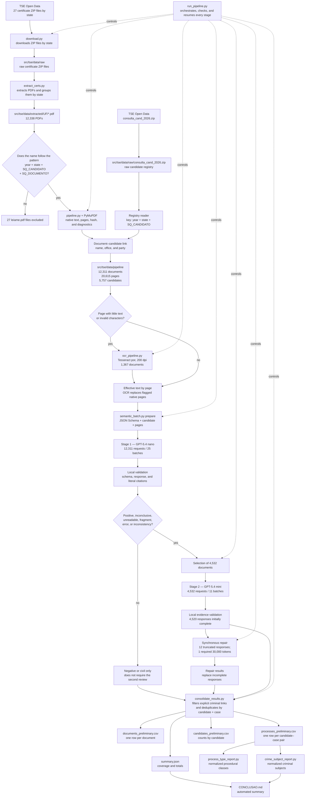
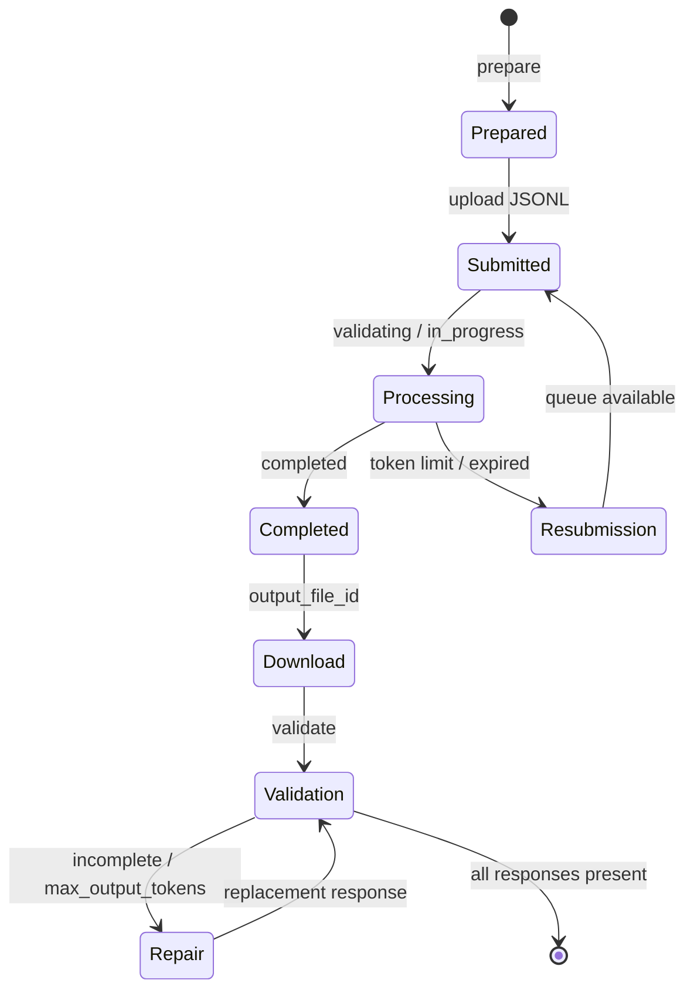

# TSE certificate pipeline architecture

The pipeline starts from public TSE files, extracts native text and selective OCR,
matches each document against the candidate registry, and runs two stages of
semantic analysis. Its output links candidates, documents, and court cases. A
case record does not imply guilt or conviction.

## Unified execution

From the project root, start or resume the complete pipeline with:

```bash
.venv/bin/python src/tse/run_pipeline.py
```

The orchestrator checks the artifacts from each stage and skips completed work.
It downloads missing inputs, extracts PDFs, runs local processing and OCR,
monitors batches, repairs truncated responses, and regenerates the tables.
`Ctrl+C` can interrupt monitoring; another execution resumes from existing files.

To inspect progress without accessing the API or modifying files:

```bash
.venv/bin/python src/tse/run_pipeline.py status
```

When raw files are already available and external downloads are not wanted:

```bash
.venv/bin/python src/tse/run_pipeline.py --no-download
```

## Main execution flow



## Lifecycle of each batch set



The `watch` mode polls the API every minute, downloads results atomically, keeps
one resubmitted batch at a time to respect the organization's queued-token limit,
and resumes from local receipts. A credit limit pauses the monitor without
deleting progress.

## Script responsibilities

| Script | Role | Main outputs |
|---|---|---|
| `run_pipeline.py` | Orchestrate and resume the complete flow | All outputs below |
| `download.py` | Download certificate ZIP files for the 27 states | `certidao_criminal_2026_UF.zip` |
| `extract_certs.py` | Extract PDFs and organize them by state | `data/extracted/UF/*.pdf` |
| `analyze_pdfs.py` | Extract and diagnose samples during calibration | `processed_sample/` |
| `triage_processes.py` | Detect CNJ mentions without assigning cases | `process_triage_sample/` |
| `pipeline.py` | Run native extraction and match the registry | `manifest.jsonl`, `texts/`, `documents/`, `candidates.csv`, `summary.json` |
| `ocr_pipeline.py` | Apply OCR only to flagged pages | `ocr/` |
| `semantic_batch.py` | Prepare, submit, monitor, download, and validate LLM work | `batch_*` directories, `validated.jsonl` |
| `consolidate_results.py` | Apply repairs, filter records, and deduplicate | Three CSVs and `summary.json` |
| `process_type_report.py` | Normalize procedural classes | `process_types_preliminary.csv` |
| `crime_subject_report.py` | Normalize criminal causes and subjects | `crime_subjects_preliminary.csv` |
| `generate_insights.py` | Generate charts and the HTML dashboard | `insights/` |

`analyze_pdfs.py` and `triage_processes.py` belong to the exploratory phase. They
helped define reading alerts, the schema, and the rules, but their counts do not
feed the consolidated result directly.

## Structured data extracted by the LLM

Each document receives one classification: positive criminal, negative criminal,
civil only, unreadable, inconclusive, or fragment. Each proposed record contains:

- case number;
- candidate's role;
- nature and procedural class;
- mention type, either primary or reference;
- subjects and their scope;
- procedural status and outcome, when explicit;
- short description;
- literal evidence with a page number.

Local validation requires evidence for the case, evidence for the relationship
when marked explicit, and evidence for subjects when populated. It checks whether
every citation appears in the text sent to the model. This confirms structural
and textual consistency; it does not replace legal or human review.

## Final state of this run

| Metric | Value |
|---|---:|
| PDFs found | 12,338 |
| Informational PDFs excluded | 27 |
| Documents processed | 12,311 |
| Pages | 20,615 |
| Candidate keys | 5,757 |
| Documents sent to mini | 4,532 |
| Documents pending after repairs | 0 |
| Candidates with an automated record | 588 |
| Numbered cases by candidate | 1,482 |
| Records without a number | 12 |

Candidate and case totals represent automated results. A case may be an
investigation, an action without judgment, an appeal, or an enforcement action;
its presence does not prove a conviction.

## Technical points to standardize

- `download.py` and `extract_certs.py` use `data/...` relative to the execution
  directory; the remaining scripts use `src/tse/data/...` derived from the script
  path.
- The `consulta_cand_2026.zip` ZIP is an additional registry input and is not
  downloaded by `download.py`.
- Stage 2 repairs must be supplied through `--override` when consolidation runs.
- The `preliminary` names were retained because the analysis did not undergo
  human review, although technical document coverage is complete.
