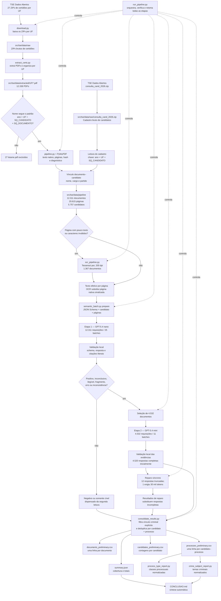
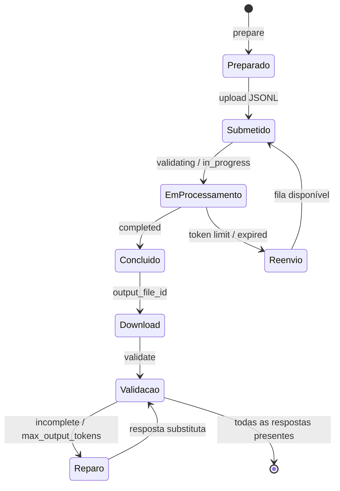

# Arquitetura do pipeline de certidões do TSE

O pipeline parte dos arquivos públicos do TSE, extrai texto nativo e OCR seletivo,
cruza cada documento com o cadastro de candidaturas e usa duas etapas de análise
semântica. A saída relaciona candidatos, documentos e processos. Um registro
processual não implica culpa ou condenação.

## Execução unificada

Na raiz do projeto, o pipeline completo pode ser iniciado ou retomado com:

```bash
.venv/bin/python src/tse/run_pipeline.py
```

O orquestrador verifica os artefatos de cada etapa e pula o que já estiver
concluído. Ele baixa entradas ausentes, extrai os PDFs, executa o processamento
local e o OCR, acompanha os batches, repara respostas truncadas e regenera as
tabelas. `Ctrl+C` pode interromper o monitoramento; uma nova execução retoma pelos
arquivos existentes.

Para inspecionar o progresso sem acessar a API ou alterar arquivos:

```bash
.venv/bin/python src/tse/run_pipeline.py status
```

Quando os arquivos brutos já estiverem disponíveis e downloads externos não forem
desejados:

```bash
.venv/bin/python src/tse/run_pipeline.py --no-download
```

## Fluxo principal executado



## Ciclo de cada conjunto de batches



O modo `watch` consulta a API a cada minuto, baixa resultados de forma atômica,
mantém um lote reenviado por vez para respeitar o limite de tokens da organização
e retoma a partir dos recibos locais. Limite de crédito pausa o monitor sem apagar
o progresso.

## Responsabilidade de cada script

| Script | Papel | Principais saídas |
|---|---|---|
| `run_pipeline.py` | Orquestrar e retomar o fluxo completo | Todas as saídas abaixo |
| `download.py` | Baixar ZIPs de certidões das 27 UFs | `certidao_criminal_2026_UF.zip` |
| `extract_certs.py` | Extrair PDFs e organizar por UF | `data/extracted/UF/*.pdf` |
| `analyze_pdfs.py` | Extrair e diagnosticar amostras durante a calibração | `processed_sample/` |
| `triage_processes.py` | Detectar menções CNJ na amostra, sem atribuir processos | `process_triage_sample/` |
| `pipeline.py` | Executar extração nativa completa e cruzar cadastro | `manifest.jsonl`, `texts/`, `documents/`, `candidates.csv`, `summary.json` |
| `ocr_pipeline.py` | Fazer OCR somente nas páginas sinalizadas | `ocr/` |
| `semantic_batch.py` | Preparar, submeter, monitorar, baixar e validar LLM | pastas `batch_*`, `validated.jsonl` |
| `consolidate_results.py` | Aplicar reparos, filtrar registros e deduplicar | três CSVs e `summary.json` |
| `process_type_report.py` | Normalizar classes processuais | `process_types_preliminary.csv` |
| `crime_subject_report.py` | Normalizar causas e assuntos criminais | `crime_subjects_preliminary.csv` |

`analyze_pdfs.py` e `triage_processes.py` pertencem à fase exploratória. Eles
ajudaram a definir os alertas de leitura, o schema e as regras, mas suas contagens
não alimentam diretamente o resultado consolidado.

## Dados estruturados extraídos pela LLM

Cada documento recebe uma classificação: positivo criminal, negativo criminal,
somente cível, ilegível, inconclusivo ou fragmento. Cada registro proposto contém:

- número do processo;
- papel do candidato;
- natureza e classe processual;
- tipo de menção, principal ou referência;
- assuntos e abrangência dos assuntos;
- situação processual e resultado, quando explícitos;
- descrição breve;
- evidências literais com número da página.

A validação local exige evidência do processo, evidência do vínculo quando marcado
como explícito e evidência dos assuntos quando preenchidos. Ela verifica se cada
citação aparece no texto enviado ao modelo. Essa validação confirma consistência
estrutural e textual; não substitui revisão jurídica ou humana.

## Estado final desta execução

| Métrica | Valor |
|---|---:|
| PDFs encontrados | 12.338 |
| PDFs informativos excluídos | 27 |
| Documentos processados | 12.311 |
| Páginas | 20.615 |
| Chaves de candidato | 5.757 |
| Documentos encaminhados ao mini | 4.532 |
| Documentos pendentes após reparos | 0 |
| Candidatos com registro automático | 588 |
| Processos numerados por candidato | 1.482 |
| Registros sem número | 12 |

Os totais de candidatos e processos representam resultados automáticos. Um
processo pode ser investigação, ação sem julgamento, recurso ou execução; sua
presença não comprova condenação.

## Pontos técnicos a uniformizar

- `download.py` e `extract_certs.py` usam `data/...` relativo ao diretório de
  execução; o restante usa `src/tse/data/...` derivado do caminho do script.
- O ZIP `consulta_cand_2026.zip` é uma entrada adicional do cadastro e não é
  baixado por `download.py`.
- Os reparos da etapa 2 precisam ser informados como `--override` ao executar a
  consolidação.
- Os nomes `preliminary` foram preservados porque a análise não passou por revisão
  humana, embora a cobertura técnica dos documentos esteja completa.
