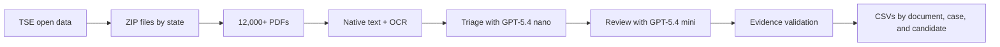

# Candidate Research — TSE criminal record certificates

**Language:** [Português](README.pt-BR.md) | English

This project downloads criminal record certificates submitted by candidates in
Brazil's 2026 elections, extracts content from their PDFs, and organizes court
case mentions by candidate. The pipeline combines native text extraction,
selective OCR, and semantic analysis with OpenAI models.

The results support questions such as:

- how many candidates are explicitly associated with criminal case records;
- how many cases were found per candidate;
- which procedural classes occur most often;
- which subjects are mentioned, such as corruption or domestic violence;
- which document and quoted passage support each extracted field.

A criminal record may be an inquiry, investigation, or case without a judgment.
A candidate's presence in this dataset does not imply guilt or conviction.

## Overview



See [Architecture.md](Architecture.md) for the detailed flow, intermediate
artifacts, and decision points.

## Requirements

- Python 3.11 or later;
- Tesseract OCR with Portuguese language data;
- an OpenAI API key with available credits;
- internet access for downloading data and running semantic analysis;
- about 7 GB for the current dataset; at least 10 GB free is recommended.

The public dataset is large. The development run used approximately:

| Directory | Approximate size |
|---|---:|
| Raw ZIP files | 2.9 GB |
| Extracted PDFs | 2.9 GB |
| Text, OCR, and results | 705 MB |

OpenAI API usage is billed. Cost depends on document volume and length, current
pricing, model selection, and generated output. Check your project balance and
limits before starting.

## Installation on Ubuntu, Debian, or GitHub Codespaces

Open a terminal in the repository root and install Tesseract:

```bash
sudo apt-get update
sudo apt-get install -y tesseract-ocr tesseract-ocr-por
```

Create and activate a Python virtual environment:

```bash
python3 -m venv .venv
source .venv/bin/activate
python -m pip install --upgrade pip
python -m pip install -r requirements.txt
```

Confirm that Portuguese is installed:

```bash
tesseract --list-langs
```

The output must include `por`.

### macOS

Using Homebrew:

```bash
brew install python tesseract tesseract-lang
python3 -m venv .venv
source .venv/bin/activate
python -m pip install --upgrade pip
python -m pip install -r requirements.txt
```

On Windows, WSL with Ubuntu is recommended. Follow the Ubuntu instructions above
inside WSL.

## OpenAI API configuration

Copy the example environment file:

```bash
cp .env.example .env
```

Open `.env` and set:

```dotenv
OPENAI_API_KEY=replace_with_your_key
```

Never publish this key. `.env` is listed in `.gitignore` and must not be committed.
You may instead configure the key in the current terminal:

```bash
export OPENAI_API_KEY="replace_with_your_key"
```

An exported variable takes precedence over `.env`.

## Run the complete pipeline

With the virtual environment active, run this command from the repository root:

```bash
python src/tse/run_pipeline.py
```

The orchestrator runs or resumes these stages:

1. download criminal certificate ZIP files for all 27 Brazilian states;
2. download the 2026 candidate registry;
3. extract PDFs into state directories;
4. extract native text and diagnose each page;
5. associate documents with candidates through `SQ_CANDIDATO`;
6. OCR pages with insufficient native text;
7. triage the full collection with GPT-5.4 nano;
8. review selected documents with GPT-5.4 mini;
9. synchronously repair responses that exceed output limits;
10. validate citations against the source text;
11. deduplicate records and generate result tables.

Batch API processing can take several hours. Each batch has a completion window
of up to 24 hours.

### Resume after interruption

The pipeline stores progress in local artifacts. If the terminal closes or you
stop the command with `Ctrl+C`, run the same command again:

```bash
python src/tse/run_pipeline.py
```

Completed stages are detected and skipped. Existing PDFs, OCR results, and API
responses are not submitted again.

### Check status without running stages

```bash
python src/tse/run_pipeline.py status
```

This command reads local files only. It does not call the OpenAI API.

### Use previously downloaded files

To prevent downloads from TSE:

```bash
python src/tse/run_pipeline.py --no-download
```

The 27 certificate ZIP files and `consulta_cand_2026.zip` must already exist in
`src/tse/data/raw/`.

### Configure local workers and batch polling

```bash
python src/tse/run_pipeline.py --workers 4 --interval 60
```

- `--workers` controls local PDF extraction processes;
- `--interval` controls the number of seconds between Batch API checks.

## Output files

Consolidated results are written to:

```text
src/tse/data/pipeline/preliminary_results/
```

| File | Contents |
|---|---|
| `documents_preliminary.csv` | Classification and record count per document |
| `processes_preliminary.csv` | Candidate, case, role, class, subject, status, outcome, and source document |
| `candidates_preliminary.csv` | Document and case counts per candidate |
| `process_types_preliminary.csv` | Grouped and normalized procedural classes |
| `crime_subjects_preliminary.csv` | Grouped subjects such as corruption and domestic violence |
| `summary.json` | Coverage and aggregate counts |
| `CONCLUSAO.md` | Portuguese summary of the development run |

CSV files use UTF-8 with a byte order mark to make Brazilian Portuguese text
easier to open correctly in Excel.

## Intermediate data layout

```text
src/tse/data/
├── raw/                         # Original ZIP files
├── extracted/                   # PDFs grouped by state
└── pipeline/
    ├── texts/                   # Native text for each PDF
    ├── documents/               # PDF diagnostics and metadata
    ├── ocr/                     # Selective OCR by page
    ├── manifest.jsonl           # Document index
    ├── candidates.csv           # Initial TSE candidate association
    ├── batch_stage1_nano_v2/    # Full collection triage
    ├── batch_stage2_mini_v1/    # Selected document review
    ├── batch_stage2_repair_v*/  # Repairs for incomplete responses
    └── preliminary_results/     # Consolidated tables
```

`src/tse/data/` is excluded from Git because it contains large downloaded and
generated files.

## How to interpret the tables

A record is counted when the automated analysis identifies:

- criminal nature;
- an explicit link between candidate and case;
- literal evidence for the case;
- literal evidence for the candidate's involvement.

Numbered cases are deduplicated by candidate and case number. Records without a
number are preserved separately.

Subjects may apply to the case as a whole and may not be individualized
allegations against a candidate. Appeals, letters rogatory, and derived cases may
also represent different procedural stages of the same underlying events.

Output names contain `preliminary` because the data was extracted automatically
and has not undergone individual human or legal review.

## Troubleshooting

### `Configure OPENAI_API_KEY no ambiente antes de enviar`

Ensure `.env` exists in the repository root and contains exactly
`OPENAI_API_KEY=...`. Do not use `OPEN_API_KEY`.

### `Billing hard limit has been reached`

Your account or project reached its billing limit. Add credits or change the
project limit in the OpenAI platform, then run the pipeline again. It will resume
pending work.

### `Enqueued token limit reached`

The organization reached its queued-token limit. Automatic monitoring waits for
the active batch to finish and submits the next one when capacity is available.

### `Instale o idioma português do Tesseract`

Install Portuguese Tesseract data on Ubuntu or Debian:

```bash
sudo apt-get install -y tesseract-ocr-por
```

### Insufficient disk space

Free at least 10 GB before a complete run. Do not delete `batch_*` directories
during processing because they contain receipts required for resuming.

### Display available arguments

```bash
python src/tse/run_pipeline.py --help
```

## Manual execution and development

For running individual stages, see:

- [Architecture.md](Architecture.md): full system design;
- [src/tse/PROCESS_EXTRACTION.md](src/tse/PROCESS_EXTRACTION.md): extraction and batches;
- [src/tse/PDF_PROCESSING.md](src/tse/PDF_PROCESSING.md): PDF diagnostics.

Check Python syntax with:

```bash
python -m py_compile src/tse/*.py
```

## Current scope

The pipeline is configured for the **2026 election**. URLs, file names, OpenAI
models, and pricing may change. Supporting another election requires making the
year configurable in downloads, registry handling, and document name parsing.
